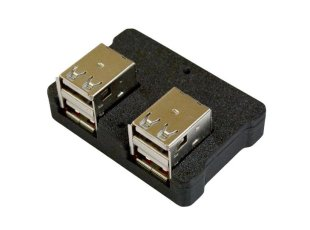
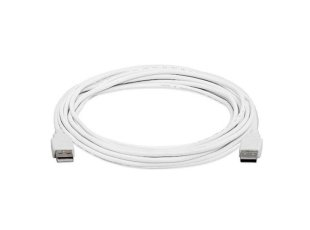
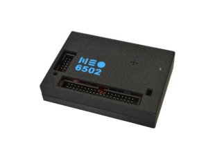
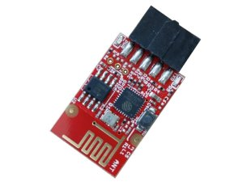
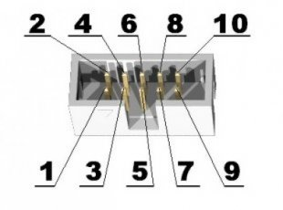

# Read this before Purchasing

## What do you need

Besides the board itself, you will need various other devices to make the computer work. Most of these are relatively straightforward.

Some however are <u>**worth acquiring when you buy the board**</u>. This is because some distributors, most in fact, charge a significant amount for postage for small orders, so if you order them later it will be more expensive. The devices shown below, and most of the UEXT boards are excellent value for money.

### USB Hub issues.

The Raspberry Pi PICO has a technical problem when used in conjunction with the tinyUSB library. Not all USB hubs work with it. If you want to use the Apple, Oric, or C64 emulators you may not need a USB hub, but "Morpheus" does. Following some investigation, it was discovered that only certain chipsets worked, so Olimex produced a small USB hub using that chipset. 

Buying this is well worth considering as it is not expensive (currently 8 Euros). If you have a USB hub, it may be worth trying. The Raspberry Pi hubs built into the keyboard appear to work correctly. But this cannot be guaranteed as the chips used may change.

This has been reported as a fault, investigated, and it seems at present it is not fixable. It is possible this hub may be integrated onto later versions of the board.

### Optional Gamepad 

Gamepads are easier to acquire. This Gamepad, a copy of a Super Nintendo controller with a USB connector can be acquired from several sources. One of the issues with USB Game controllers is that there seems to be no standard (if you look at the Linux source there is a list of driver options for all sorts of keyboards). Currently we only support certain types of keyboards. Again, this is obtainable from Olimex and it will be the 'correct model'. The author has similar looking gamepads not acquired from Olimex, and they seem to work (it depends on the USB ID) but they may not. There is support for some other gamepads included.

It's <u>not</u> a requirement. The "Operating System" of Morpheus uses keyboard keys if no gamepad is present.

### A-A cable or Programmer

To program the Pico , you either need a USB A - USB A cable is required, it is also possible to use a Programmer and the 'openocd' software as developers for the Pico do. The Neo6502 usually comes programmed with an Apple 2 emulator and Morpheus is still updated for bug fixes and occasional enhancements. It is not required for to day to day use of the machine.

### Case

This is completely optional ; it is a small box which the Neo6502 board fits into, all the main sockets and connectors are exposed. For P&P reasons , if you want it, it probably makes sense to order it at the same time as the board. It is available in blue or red lettering.

## Internet connection

Neo6502 now has an internet connection and a program source written by Wojciech Bocianski (aka "Bocianu"). This is not built in and requires [this board](https://www.olimex.com/Products/IoT/ESP8266/MOD-WIFI-ESP8266/open-source-hardware) which plugs into the UEXT port.

### UEXT Devices

Olimex produced UEXT modules which are listed [here](https://www.olimex.com/Products/Modules/), for the same reasons if you want one in particular it is worth ordering it at the same time. The majority of these devices are economically priced. The Basic and API have simple commands for interfacing with SPI, I2C and Serial Devices. 

## Common Devices

### Keyboard

A standard USB keyboard is used, these seem to work almost 100%.

### HDMI display

The output is DVI through a HDMI connector. There is currently a discussion about whether it should be powered or not, currently it is not. It does not seem to work well with adaptors and some displays, notably LG.

### USB Key

If you want to save programs then a USB key is required (It is possible to use SD Cards). For similar reasons to the USB Hub we believe, it requires a fast key. Initially I used "Amazon Cheapies" and none of them worked properly. I replaced this with a Sandisk USB 3.0 key which was about £10 and it works fine.

### Power Cable

Power is supplied through a USB C type cable of the type that are commonly available.

### Sound Device

Sound is provided on board by a simple buzzer. This is perfectly okay for beeps and squawks, and fairly audible. It is possible to plug a sound device in which has a 3.5mm Jack plug.

### SD Card (as an option)

The system does still support the use of SD Cards. This requires the Olimex UEXT SD Card adaptor.

[Where to buy a Neo6502](where.md)