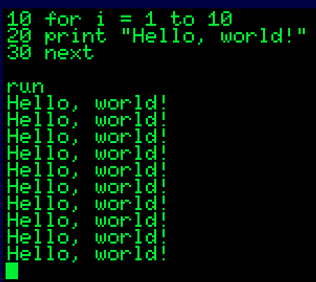
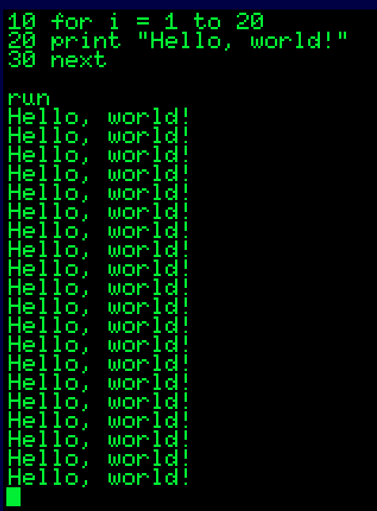

## Check it works and doing a Catalogue

Below the USB list it should say "Welcome to NeoBasic" in green. You are now running a classic BASIC interpreter - so for example

`print 22/7` [ENTER]

causes 3.142857 to be printed. If  you type 

`cat`

it should list all the files in the root directory of the USB key

## Running a simple BASIC program

To get you started, and show you some of our neater features, we will write a very simple BASIC program, which many of you will have seen many times.

```
10 for i = 1 to 10
​
20 print "Hello, world !"
​
30 next
```

and type run to run it, like this.



### Using the screen editor

Many people don't like line number programming. Even with an on screen editor - you can move the arrow keys up and make the 10 at the end of line 10 to 20, press [ENTER] and run it again.



### Using the BASIC Text Editor

But the developers decided it would be better to have a proper editor. (It is possible to cross-develop in BASIC using the emulator or the serial port)

So type `edit` and press ENTER


And you can edit like on a word processor (Ctrl+P and Ctrl+Q insert/delete lines). Not a very good word processor, but it's better than line numbers. 

When you have finished press ESC to leave the editor and you can run it again. You can speed this up using the function keys e,g, from the BASIC command line (e.g. where you type stuff in)

`fkey 1,"edit"+chr$(13)`

This sets function key F1 on the keyboard to type edit and press ENTER (character code 13).

### Saving Loading and "Cat"ting

You can save your program with

`save "hello.bas"`

It is a convention that .bas is used for BASIC files, but it's not mandatory. You can reload it with`load "hello.bas"` and run it with `run "hello.bas"`

`cat` should show it stored in the directory ; if you have lots of files already you can `cat "hell"` which will show all files with hell in it.

[Where do I go next ?](next.md)